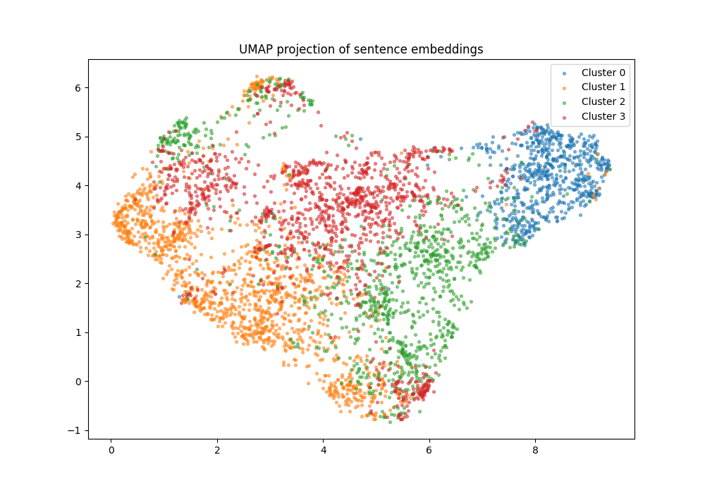
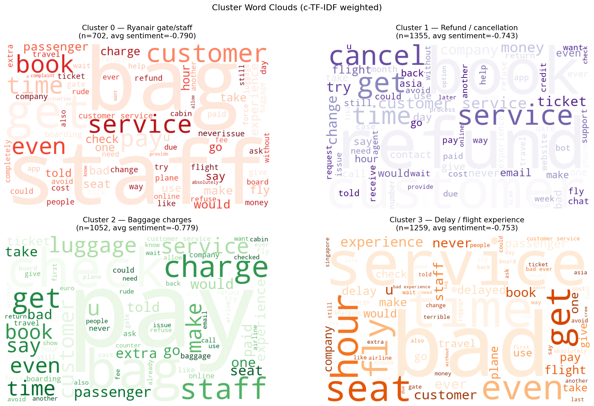
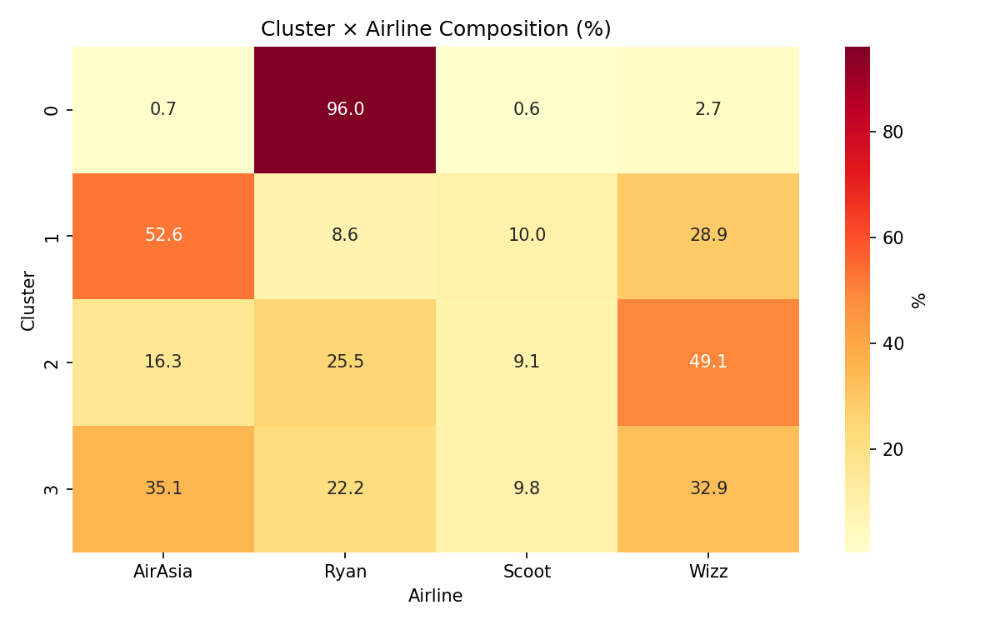
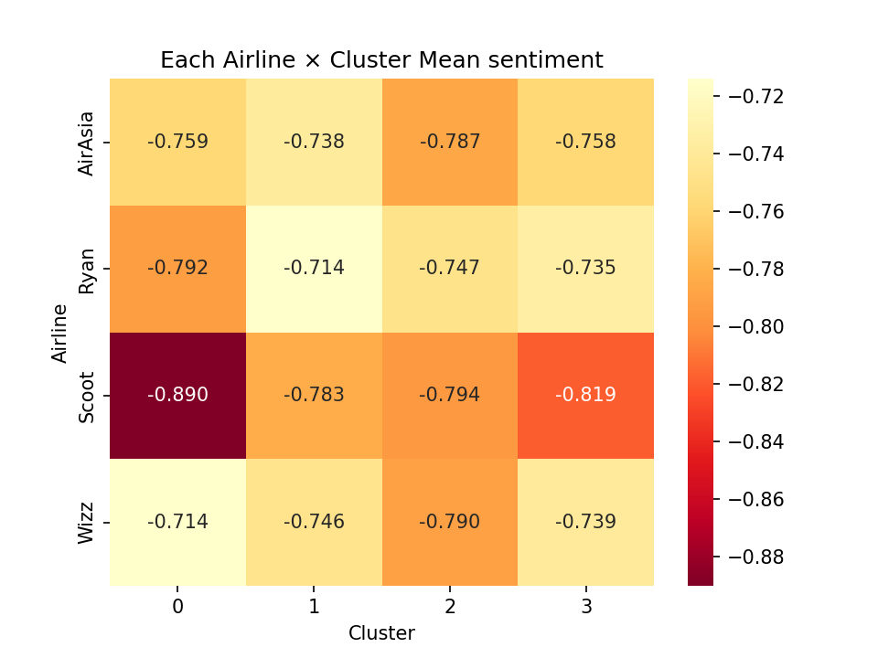

# LCC Airline Review Analysis

**Project**: Social Media Analytics — Low-Cost Carrier complaint analysis
**Dataset**: 6,460 Trustpilot reviews across 4 airlines (Wizz, Ryanair, AirAsia, Scoot)
**Last updated**: 2026-05-27

A 6-step analysis report: from business problem to expected value.

📊 **[View the interactive HTML report →](https://sciencemj.github.io/LCC_Review_Sentiment_Cluster/report.html)**

---

## 1. What is the problem?

**Low-cost carriers (LCCs) collect a lot of bad reviews — but they can't spend much money on service improvement.** Their entire model is built on keeping costs (and ticket prices) low, so a blanket "improve everything" response is off the table.

The real question is therefore one of **prioritization**: *which* complaints hurt the most, and which of those can be addressed cheaply? Without that focus, an LCC either overspends fixing the wrong thing or does nothing and keeps losing customers.

---

## 2. What data to use?

**Collected LCC review data from two review websites** using Selenium:

- **Trustpilot** — general consumer review platform (`Trustpilot.pkl`)
- **Skytrax** — airline-specific review platform (`Skytrax.pkl`)

Reviews were labeled by airline across 4 budget carriers (Wizz, Ryanair, AirAsia, Scoot).

The final clustering analysis focuses on the **6,460 Trustpilot reviews**. Merging Skytrax in was tested but degraded cluster quality because the two sites' review styles differ too much (see §6 Limitations) — single-source was cleaner.

> Notebook: `LCC_data_collect.ipynb`

---

## 3. What analytical technique to use?

Two techniques, used together: **sentiment analysis** to measure how negative each review is, and **clustering** to find what people complain about.

### 3.1 Sentiment analysis
Scored every review with **VADER** (a rule-based English sentiment tool from NLTK), from -1 (very negative) to +1 (very positive). Kept only reviews scoring < -0.3 to focus on genuine complaints → **4,368 negative reviews**.

### 3.2 Clustering — finding complaint types

Two approaches were tried:

**Approach A: TF-IDF + K-means → didn't work.** TF-IDF turns text into a sparse word-count matrix. The elbow plot was nearly flat (WSS dropped only 2.9% from K=1 to K=6) — K-means couldn't separate groups because the high-dimensional sparse vectors all looked similarly distant.

**Approach B: Sentence embeddings + K-means → adopted.** Used `all-MiniLM-L6-v2` (a small pretrained transformer) to convert each review into a 384-dimensional dense vector that captures meaning. Clusters separated much better — silhouette score peaked at **K=4**.



*UMAP projection of the embeddings — the four clusters form visibly separable regions.*

Each cluster was then interpreted with **c-TF-IDF** (words distinctive to that cluster) plus word clouds.

> Notebook: `LCC_analyze_trustpilot.ipynb`

---

## 4. What business insight?

**There are a few typical types of complaint — and one type carries distinctly harsher negative sentiment than the others.**

### 4.1 The 4 complaint clusters

| Cluster | Theme | n | Mean sentiment | Dominant airline |
|---|---|---|---|---|
| **0** | Gate baggage fees & staff conduct | 702 | **-0.790** | Ryanair (96%) |
| **1** | Refund & cancellation disputes | 1,355 | -0.743 | AirAsia (53%) |
| **2** | Check-in baggage charges | 1,052 | **-0.779** | Wizz (49%) |
| **3** | Delays & general flight experience | 1,259 | -0.753 | AirAsia (35%) |

- **Cluster 0** — Ryanair's "bag sizer at the gate + surprise £55-60 fee" model, plus staff-conduct complaints. The angriest cluster.
- **Cluster 1** — long refund battles (esp. post-COVID); AirAsia's AI chatbots ("AVA", "Bo") recur as a pain point. Exhausted tone, not rage.
- **Cluster 2** — surprise baggage fees at the check-in desk. Same friction as Cluster 0 but earlier in the journey, across more airlines.
- **Cluster 3** — catch-all "bad flight": delays, seating, general dissatisfaction.



*Distinctive (c-TF-IDF) keywords per cluster — baggage/staff (0), refund/cancel (1), check-in/pay (2), delay/worst (3).*



*Each airline's complaints concentrate in a different cluster — they are not "bad" in the same way.*

### 4.2 The key finding: sentiment splits into TWO groups

A pairwise t-test of cluster sentiment (`Cluster_Score_diff.pdf`) shows the four clusters are **not four separate sentiment levels — they collapse into two statistically distinct groups.**

| Comparison | Mean difference | p-value | Different? |
|---|---|---|---|
| Cluster 0 vs 2 | -0.011 | 0.217 | **No** — same group |
| Cluster 1 vs 3 | 0.010 | 0.175 | **No** — same group |
| Cluster 0 vs 1 | -0.048 | < .001 *** | Yes |
| Cluster 0 vs 3 | -0.038 | < .001 *** | Yes |
| Cluster 2 vs 1 | 0.036 | < .001 *** | Yes |
| Cluster 2 vs 3 | -0.027 | < .001 *** | Yes |

So:

- **Group A — Harsher (mean ≈ -0.78 to -0.79): Clusters 0 + 2.** Statistically indistinguishable from each other (p=0.217). **Both are baggage-fee / in-person friction** — surprise charges at the gate and at the check-in desk.
- **Group B — Milder (mean ≈ -0.74 to -0.75): Clusters 1 + 3.** Statistically indistinguishable from each other (p=0.175). These are **async disputes (refunds) and operational issues (delays)**.

Every cross-group comparison is significant at p < .001, so the two-group split is real, not noise.



*Mean sentiment by airline and cluster — the baggage-fee clusters (0, 2) run consistently darker (harsher) than the refund/delay clusters (1, 3).*

**Interpretation**: the harshest anger isn't about money lost in the abstract — it's about **in-person confrontation over surprise fees**. Being charged unexpectedly, face-to-face, at the gate or desk produces a stronger negative reaction than a long, remote refund fight or a delayed flight.

---

## 5. Recommendation

**Prioritize complaints that are high in sentiment intensity but low in cost to solve.**

That points directly at **Group A (baggage-fee friction, Clusters 0 + 2)**:

- **Highest sentiment intensity** — these are the angriest customers, so fixing them moves the needle most on perceived experience.
- **Lowest cost to solve** — the problem is *surprise*, not the fee itself. Making fees transparent is cheap: upfront total-price displays at booking, clear cabin-bag sizing and pricing before the airport, and consistent gate/desk signage. None of this requires cutting the ancillary revenue the LCC model depends on.

By contrast, Group B is a poorer first target: refund disputes (Cluster 1) need costly customer-service / automation overhauls, and delays (Cluster 3) are operationally expensive to fix — and both already carry *milder* sentiment.

**Per-airline focus:**

| Airline | Where to act first |
|---|---|
| **Ryanair** | Gate baggage transparency (Cluster 0 — its harshest, dominant complaint) |
| **Wizz** | Check-in fee transparency (Cluster 2) |
| **AirAsia** | Longer-term: refund/chatbot trust (Cluster 1) — but lower priority by sentiment |
| **Scoot** | Diffuse complaints, no single weakness — monitor rather than invest heavily |

---

## 6. Expected value

**Less negative customer experience → fewer customers lost.**

The two harsh clusters (0 + 2) represent **1,754 of 4,368 negative reviews (~40%)** and the worst sentiment in the dataset. Converting surprise-fee anger into "I knew what I was paying for" — at minimal cost — reduces the most damaging, most public complaints, protects word-of-mouth and review scores, and lowers churn without raising prices. The spend is small (communication and pricing display, not service cuts); the retained-customer payoff is large.

---

## Appendix A — Visualizations

| File | What it shows |
|---|---|
| `cluster_wordclouds.png` | 4-panel word cloud per cluster |
| `cluster_airline_heatmap.png` | Cluster × Airline % matrix (per-airline weaknesses) |
| `cluster_airline_sent_heatmap.png` | Airline × Cluster mean sentiment (emotional intensity) |
| `cluster_umap.png` | 2D UMAP scatter — clusters are real/separable |
| `Cluster_Score_diff.pdf` | Pairwise t-test of cluster sentiment (the 2-group evidence) |

---

## Appendix B — Known limitations

1. **Silhouette score is low (0.049)** — clusters exist but aren't sharply separated. Normal for pre-filtered negative reviews that all share a "complaint" semantic.
2. **Trustpilot only** — merging Skytrax made clusters worse (review styles too different). Cleaner, but less generalizable.
3. **VADER is rule-based** — not trained on airline text; sarcasm and context can mislead it, so some sentiment scores may be wrong.
4. **English-only** — non-English reviews scored unreliably.

---

## Appendix C — Files reference

| File | What it is |
|---|---|
| `LCC_data_collect.ipynb` | Selenium scraping notebook |
| `LCC_analyze_trustpilot.ipynb` | Main analysis (final version) |
| `LCC_analyze_total.ipynb` | Test with Skytrax added — reference only, not in final |
| `Trustpilot.pkl` | Raw scraped Trustpilot reviews |
| `Skytrax.pkl` | Raw scraped Skytrax reviews |
| `bad_reviews.csv` | Clustered output (4,368 rows) |
| `Cluster_Score_diff.pdf` | Pairwise cluster sentiment t-test |
| `cluster_*.png` | Word clouds, heatmaps, UMAP plot |

---

## Appendix D — How to run

```bash
# Install dependencies (uv)
uv add nltk pandas scikit-learn matplotlib seaborn
uv add sentence-transformers wordcloud umap-learn

# NLTK data
python -c "import nltk; nltk.download('vader_lexicon'); nltk.download('punkt'); nltk.download('stopwords')"

# Run the main notebook: LCC_analyze_trustpilot.ipynb → Restart and Run All
```

Random seeds: `KMeans(random_state=0)`, `UMAP(random_state=42)` — results are reproducible.
